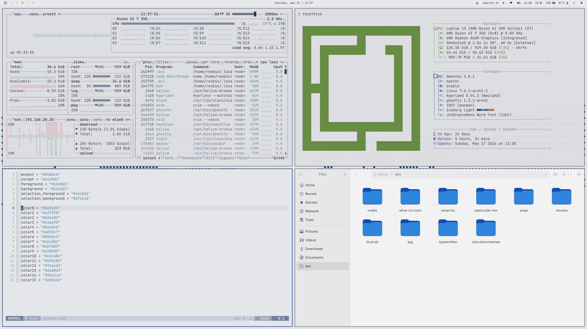

# `omarchy-iceberg-light-theme`

`omarchy-iceberg-light-theme` is a light omarchy theme built around [`cocopon/iceberg.vim`](https://github.com/cocopon/iceberg.vim).



## Installation

```bash
omarchy-theme-install https://github.com/vimcolorschemes/omarchy-iceberg-light-theme.git
```

## Usage

Select `iceberg-light` from the omarchy theme picker, or apply it with:

```bash
omarchy-theme-set iceberg-light
```
